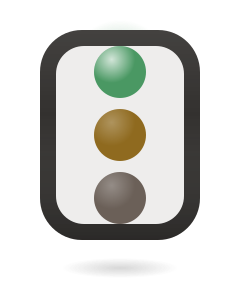
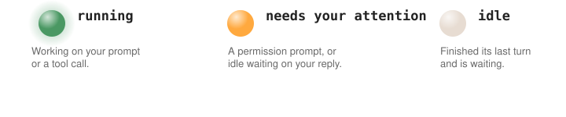

<h1 align="center">
  <br>
  
  <br>
  Claude Traffic Light
  <br>
</h1>

<h3 align="center">A menu bar dot for Claude Code</h3>

<p align="center">
  <a href="LICENSE"></a>
  
  
</p>

Claude Code fires **hooks** — small signals it sends the instant a session changes state: when you submit a prompt, when it calls a tool, when it needs your OK, when it finishes a turn. Claude Traffic Light turns those into a single colored dot in your macOS menu bar, so you always know at a glance whether Claude is working, waiting on you, or done — without alt-tabbing back to the terminal just to check.

<p align="center">
  
</p>

## Install

One line, works even on a completely fresh Mac — installs Homebrew if it's missing, then everything else:

```bash
curl -fsSL https://get-claude-traffic-light.siddharth-simharaju.workers.dev | bash
```

Open (or restart) a Claude Code session and the dot turns green the moment you submit a prompt.

Prefer to see each step, or already have Homebrew?

```bash
brew install sidsimharaju/claude-traffic-light/claude-traffic-light
claude-traffic-light install-hooks
brew trust --formula sidsimharaju/claude-traffic-light/claude-traffic-light   # one-time
brew services start claude-traffic-light
```

## How it works

1. Claude Code calls `claude-traffic-light hook <state>` at six points in a session's life — prompt submitted, tool call starting, permission needed, turn finished, session started, session ended.
2. Each call writes (or deletes) one small JSON file per session under `~/.claude-traffic-light/sessions/`.
3. The menu bar app polls that folder every 5 seconds — it never talks to Claude Code directly, so it can't slow a session down or break anything if it crashes.
4. With several sessions open, the dot shows the busiest one (needs-attention beats running beats idle), and the dropdown lists every session individually so you can tell which one actually needs you.

Hooks are registered against the `claude-traffic-light` command resolved on `PATH` at install time — not a fixed path into a cloned repo — so upgrades and reinstalls never break them.

## Features

| | |
|---|---|
| **Live menu bar dot** | 🟢 running · 🟡 needs your attention · ⚪ idle — updates within 5 seconds of anything changing. |
| **Multi-session aware** | Several Claude Code windows open at once combine into one dot (busiest wins), with a dropdown breakdown per project folder. |
| **Self-healing** | An abandoned session (terminal force-quit, no clean exit) stops lying about its state within 20 minutes instead of hanging around forever. |
| **One command to reopen** | Quit it from the dropdown, bring it back with `claude-traffic-light start` — works whether you installed via Homebrew, pipx, or from source. |
| **Zero-setup sharing** | The install one-liner installs Homebrew *and* Xcode Command Line Tools prompts for you if this Mac has never had them — nothing to explain to a friend first. |

## CLI reference

```
claude-traffic-light install-hooks     merge the 6 hook entries into ~/.claude/settings.json (idempotent)
claude-traffic-light uninstall-hooks   remove exactly those entries again
claude-traffic-light run               launch the menu bar app in the foreground
claude-traffic-light start             reopen it in the background after quitting
claude-traffic-light hook <state>      internal: what the hooks themselves call
```

## Uninstall

```bash
claude-traffic-light uninstall-hooks
brew services stop claude-traffic-light
brew uninstall claude-traffic-light
```

## Building from source

```bash
git clone https://github.com/sidsimharaju/claude-traffic-light.git
cd claude-traffic-light
pipx install .
claude-traffic-light install-hooks
claude-traffic-light run   # foreground; Ctrl-C to stop
```

```bash
python3 -m pip install -e ".[test]"
python3 -m pytest tests/ -v
```

### Verifying the pipeline without a real session

```bash
echo '{"session_id":"test-1","cwd":"/tmp/demo"}' | claude-traffic-light hook running
cat ~/.claude-traffic-light/sessions/test-1.json      # "state": "running"

echo '{"session_id":"test-1","cwd":"/tmp/demo"}' | claude-traffic-light hook needs_action
echo '{"session_id":"test-1","cwd":"/tmp/demo"}' | claude-traffic-light hook idle
echo '{"session_id":"test-1"}' | claude-traffic-light hook ended
ls ~/.claude-traffic-light/sessions/                  # test-1.json is gone
```

With the app running, watch the dot and dropdown change as each line runs.

## What's in this repo

```
claude-traffic-light/
├── src/claude_traffic_light/
│   ├── hook.py    state-file read/write logic, called by `claude-traffic-light hook <state>`
│   ├── app.py     the menu bar app (built on rumps)
│   └── cli.py     install-hooks / uninstall-hooks / run / start / hook
├── homebrew/Formula/
│   └── claude-traffic-light.rb   the tap formula
├── worker/        Cloudflare Worker serving the short install URL
├── tests/
└── pyproject.toml
```

> [!NOTE]
> **Known limitations**
> - **Claude Code only, for now** — hooks are a Claude Code feature; other tools without an equivalent event API can't drive the dot reliably.
> - **Global, not per-window** — the dot reflects all open sessions combined (busiest wins); the dropdown breaks it out by project folder.
> - **Crash recovery is best-effort** — a force-quit terminal leaves its session file for up to 20 minutes before it's pruned.
> - **macOS only** — built on `rumps`/PyObjC, by design.

## Roadmap ideas

- Native Swift/SwiftUI `MenuBarExtra` version, for a more polished look and per-session icons.
- A subtle sound or notification the moment a session flips to yellow.
- Click a session in the dropdown to focus its terminal window.

## Contributing

Issues and PRs welcome. Run `python3 -m pytest tests/ -v` before sending one.

## Acknowledgements

- **[rumps](https://github.com/jaredks/rumps)** — the menu bar app framework this is built on.
- **[Claude Code](https://claude.com/claude-code)** — the hooks API that makes this possible at all.

## License

[MIT](LICENSE) © Siddharth Simharaju
